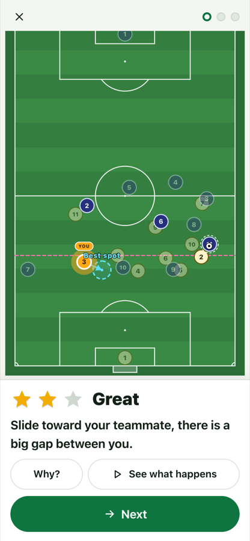
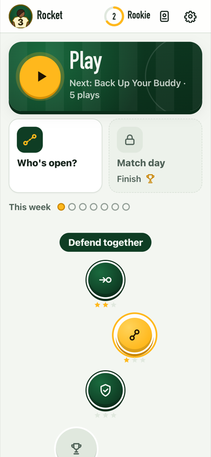
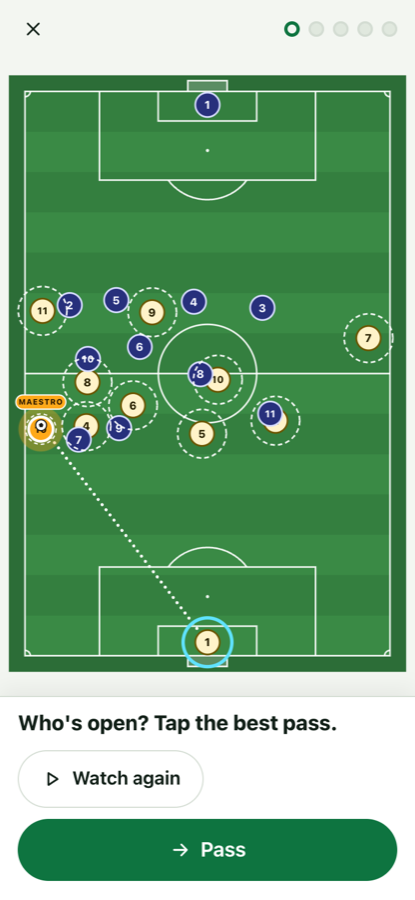

# fotbol

**Learn where to stand.** fotbol is a free football (soccer) game about positioning, made for players of about 10 to 14. You play one position, watch a bit of a match, and when the whistle stops play you move yourself to where you should be. The pitch then shows you the right area in green, with the best spot inside it, you get up to three stars, and one plain sentence tells you why.

**▶ Play it now: <https://scotchtowel17.github.io/fotbol/>** (phones, tablets and computers)

No account, no ads, no tracking. Your progress stays on your device.

<p>
  
  
  
</p>

## Your first minute

1. Tap **Play**, then tap what you play: **Defender**, **Midfielder**, **Winger** or **Striker**. That's it: no sign-up, no tour.
2. A short bit of play runs, first as a small game of just a few players. The whistle blows and play freezes: "The ball is on the other side now. Where do you go?"
3. The first time, a hand shows you the best spot, then it's your turn. Drag yourself there (or tap yourself, then tap a spot) and press **Lock it**.
4. The pitch shows the right area in green, with the best spot as a ring inside it. Anywhere in the green is three stars; just outside it is two; and if you missed, an arrow shows you the way in. Being on the wrong side of your player or the ball, offside, or where you started is never right, however close. You get 0 to 3 stars and one word (Spot on, Great, Close or Not yet), never a grade or a score out of 100. **Why?** tells you a little more, **Try again** gives you the same idea on the other side (just practice: your first try is the one that counts), and **See what happens** plays on.
5. After three plays it's Full time. Then you pick your shirt colour, number and a nickname, and you're on the home screen.

## Player mode and Coach mode

**Player mode** is what everyone sees first, and it is built for young players (the design and the research behind it are in [docs/KID_REDESIGN.md](docs/KID_REDESIGN.md)):

- **The Road**: four chapters (Defend together, Help the ball, Pass it right, Move as one) of short sets of five plays, each about one to three ideas like "Back Up Your Buddy" or "Stay in Line". Finishing a stop opens the next one, stars or not (the stars stay your quality signal, and Play always offers a fresh stop before a replay); each chapter ends with a match, and midfielders, wingers and strikers get the attacking chapter early. The home shows the chapter you are in with its stops, and the other chapters fold up behind their names. Stop a set whenever you like: the plays you finished still count.
- **Small games first**: a new stop starts with small games (2 v 2, 3 v 2, just the players the idea is about, so they are big and easy to see) and builds up to a bigger game and then the full 11 v 11 match as you earn its stars. The players are little figures in their kits, faces left blank, and the ball is big, with a bright yellow ring, so you can always find it.
- **Who's open?**: now you have the ball. Tap the teammate you'd pass to, watch the ball go, and see the options marked on the pitch: ★ Best, ✓ Good, ! Risky or ✗ Cut out.
- **Match day**: 45 seconds of play where you keep moving to the best spot. Your ring turns green in the right area, and the big word is one you already know: Spot on, Great, Close or Not yet.
- **Your card**: a player card with your Road stars for each chapter, a sticker album, five badges and your kit.
- Words kids can read (checked for reading age), no codes or jargon on screen (when two players of a kind are on show, the words name the one they mean by shirt number: "their number 7"), and rewards that are fair: stars come from good positions, the days-played-this-week dots only fill up, nothing is left to chance, and nothing compares you with anyone else.

**Coach mode** is for coaches and parents: open the settings, choose "Coach or parent? Open Coach mode" and answer a quick grown-up sum ("Back to Player mode" returns). It is the full tool (round player tokens instead of figures, with the same easy-to-see ball), and playing in it never changes the player's card (stars, XP, stickers and badges are earned in Player mode only):

- **Drill**: the 36 authored situations, scored out of 100 with a grade, the principle behind each reason, a cue question before the answer, and a summary per session.
- **Learn**: a seven-step guided tour of the pitch, plus a library of every principle with sources and a reading list.
- **Explore**: drag the ball anywhere and see where you should be, with the reasons live.
- **Live**: 45 or 60 seconds of continuous play, scored ten times a second, then your three toughest moments.
- **Progress**: your level, stars for each principle, days played this week, your positions and history, with export and import of your progress. Plus the trophy room and the scenario editor (**Author**).


fotbol works with a keyboard (Tab to yourself, arrow keys to move, Enter to lock it), respects your device's reduced-motion setting, and has light and dark themes.

## The research behind it

fotbol is built on a research report, [docs/RESEARCH.md](docs/RESEARCH.md), and Player mode on a second one about how 10 to 14 year olds learn and play ([docs/research/kid-learning.md](docs/research/kid-learning.md), with an audit of the first version through an 11-year-old's eyes in [docs/research/kid-audit.md](docs/research/kid-audit.md) and the passing research in [docs/research/passing.md](docs/research/passing.md)). In short:

- **Nothing like it existed.** Existing tools are either multiple-choice "soccer IQ" quizzes or tactics boards with no right answer. None combines one assigned role, a moving scene, a free drag-to-place answer, a visible ideal zone and a principle-based "why".
- **Place, don't pick.** Training transferred better when learners answered with a movement-like response rather than by choosing an option. Freezing play just before the decisive moment and then replaying it is one of the best-supported video-training methods.
- **Explain, don't just correct.** High-information feedback that says why beats a bare right or wrong. The pitch shows the answer first (the ring and an arrow), then one short sentence says why; Coach mode first asks a cue question ("If your left-back gets beaten, who is there to stop the carrier?") and only then states the principle and the fix.
- **Short words, one job per screen.** Young readers read slowly, so Player mode keeps a question to 12 words, the answer line to 14 and everything before "Why?" to 30, at a reading age of 9, and shows only the pitch and one line while you watch and decide. A worked example comes first, then a helper ring that glows warmer near the best spot, then you're on your own.
- **Aim for about 3 in 4.** Difficulty adapts per principle and per position with an Elo rating that targets roughly 75% success. Look-alike situations, such as cover versus balance or pressing versus dropping, are mixed together once the basics are in place.
- **Mastery, not points.** Stars come from how good your positions are, never from time spent or just finishing; Coach mode also asks you to rate your confidence, because a confident mistake is the one you learn most from. There are no leaderboards, no streaks that can break, no prizes left to chance and no data collection. Almost every distance in the engine is a labelled default waiting for coach review, and the report says so.

### Best resources to learn positioning

These are the first five entries of fotbol's reading list (`data/resources.json`, also at `#/learn/resources` in the app):

1. [US Youth Soccer ODP Player Manual](https://www.usyouthsoccer.org/wp-content/uploads/sites/160/2023/09/Player-Manual-US-Youth-Soccer-ODP.pdf) (free). A short manual written for players, with ten principles of play as simple rules.
2. [U.S. Soccer Coaching Curriculum (2011)](https://cdn2.sportngin.com/attachments/document/0073/5091/Full_U.S._Soccer_Coaching_Curriculumnew.pdf) (free). Diagrammed definitions of support, width, depth, pressure, cover, balance and compactness. These are the words fotbol uses in its feedback.
3. [Coaches' Voice: football tactics explained](https://learning.coachesvoice.com/cv/glossary-football-tactics-coaching/) (free, with some members-only explainers). Covers blocks, half-spaces, rest defence and pressing.
4. [The Football Analyst: football tactics explained](https://the-footballanalyst.com/pressing-triggers-football-tactics-explained/) (free). Plain-language tactics articles.
5. [Soccer iQ, volumes 1 and 2](https://www.goodreads.com/book/show/21451166-soccer-iq) (Dan Blank, book). Short, rule-like chapters on game habits for players.

## How it works

The engine lives in `js/engine/`. It is plain JavaScript that runs the same in the browser and in Node. It judges a spot in three layers:

1. **Where your position usually stands (layer A).** A formation table gives all 11 positions for any ball position. It is converted from the open-source HELIOS robot-football team, interpolated with a Delaunay triangulation, and adjusted for in- and out-of-possession shape. This spot is the centre of your zone.
2. **What the situation asks of you (layer B).** First, fotbol works out your job from the ball: first, second or third defender, or supporting attacker. Then 27 small geometric rules check the principles that apply, for example "goal-side of your man", "cover behind and inside the presser", "level with your back line", "out of the passing shadow" or "stay onside". Each rule gives a 0-1 score and a sentence.
3. **The best spot (layer C).** A grid search around your zone finds the highest-scoring spot. That spot is the ghost ring you see after the reveal, drawn over a heatmap.

Your score is 55% "how close to your zone" and 45% "which principles you met". Breaking a hard rule, such as being offside or playing their striker onside, caps it at 59. Coach mode shows that score and its grade. Player mode never shows the number and judges the right area instead (`js/engine/kidscore.js`): 3 stars anywhere in an area round the best spot about as big as your position's zone, fewer further out (the score can lift the band a little, never to 3: three stars live in the green and nowhere else), none where you started, and at most one for a mistake no distance forgives, such as the wrong side of your man, offside at a pass or the drill's own lesson clearly missed. The other 21 players move automatically as an authored ball path plays out, so each drill is a moving scene with no physics engine behind it.

When you have the ball ("Who's open?"), `js/engine/passing.js` rates every pass you could play: how likely it is to arrive (the lane, who can get there first, the pressure on your teammate) and what it gains (lines broken, space, the danger if it is lost). A risky pass is starred only when it is worth clearly more than the best safe one, and a safe pass earns two stars or more unless a clearly better forward pass was on. `js/engine/passdrill.js` builds those drills from match-like scenes and keeps only the ones with a clear best pass and a tempting wrong one. `js/engine/spotdrill.js` builds new "Find your spot" drills the same way, so the Road never runs out of plays, and keeps only the ones that pass the same quality checks as the 36 hand-made drills.

## Run it locally

fotbol has no build step and no dependencies. Serve the folder with any static web server:

```bash
npm run serve          # python3 -m http.server 8080, then open http://localhost:8080
npm test               # every test with node --test (Node 22 or later); tests.html runs the same files in a browser
npm run check          # validate every scenario, print the engine's answer and the small or bigger games it can be played as, and check that data/scenarios/index.json is current
npm run index          # rebuild data/scenarios/index.json after adding or changing a scenario
npm run sanity         # rewrite docs/sanity-output.txt: the engine's answers on the canonical situations, for coach review
```

`#/dev` is the engine playground. It shows the ghost, the heatmap and the live score while you drag yourself or the ball. Coach mode's settings menu links to it and to `tests.html` only when the address has `?dev` (for example `http://localhost:8080/?dev#/coach`), so learners never land in developer tools by accident. `?dev` also opens Match day before it is unlocked.

## For contributors and coding agents

Start with [AGENTS.md](AGENTS.md) (commands, hard rules, where things live), then [docs/ARCHITECTURE.md](docs/ARCHITECTURE.md) (the binding module contracts and data shapes) and [docs/ROADMAP.md](docs/ROADMAP.md) (status, what's next, known issues).

To add a scenario (the in-app editor left the shipped app with the 2026-10-01 audit; scenarios are authored as files):

1. Copy `data/scenarios/_example.json` to `data/scenarios/<id>.json`. Script the ball, override the players who create the situation, and set when play freezes.
2. Run `npm run check`: it prints the engine's answer per drill and warns you when the drill is trivial, when the principle is not actually tested, or when the best spot does not score an S.
3. Write the brief, question, takeaway and misconceptions in both detailed and simple wording (the `*Kid` fields: Player mode shows only these, and `tests/copy.test.js` holds them to a reading age of 9 and the word budgets). The text must never name a side, because every scenario is also played mirrored.
4. Check it in the app (`#/drill/s/<id>` plays one scenario).
5. Add the id to its module in `data/curriculum.json`.
6. Run `npm run index`, `npm run offline` (the file list the app stores for offline play), `npm run check` and `npm test`. Every scenario must give an S-grade best spot at least 5 m from where you start, and must pass the copy rules in `tests/scenarios-content.test.js`. `npm run check` also fails a drill that can be played as neither a small nor a bigger game, unless its `"stages"` note says why (docs/PROGRESSIVE_FIELD.md). Player mode's Road picks new drills up by their principles (`data/road.json`), and `tests/road-sets-*.test.js` checks that every stop still builds a full set for every position.

## Credits and licence

fotbol is MIT-licensed ([LICENSE](LICENSE)). It uses:

- formation data converted from [HELIOS Base](https://github.com/helios-base/helios-base) (MIT);
- [Delaunator](https://github.com/mapbox/delaunator) (ISC);
- [robust-predicates](https://github.com/mourner/robust-predicates) (Unlicense).

The details and attributions are in [THIRD_PARTY.md](THIRD_PARTY.md) and on the in-app `#/credits` page. The football ideas are paraphrased from the coaching literature listed in [docs/RESEARCH.md](docs/RESEARCH.md) §10. Nothing is copied, and every principle page links to its sources.
